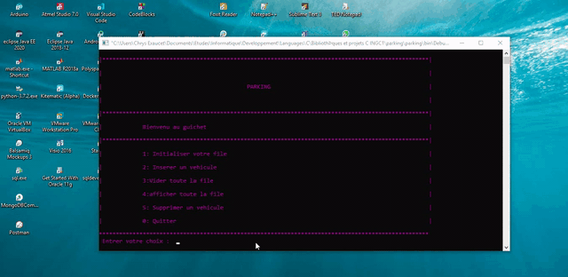
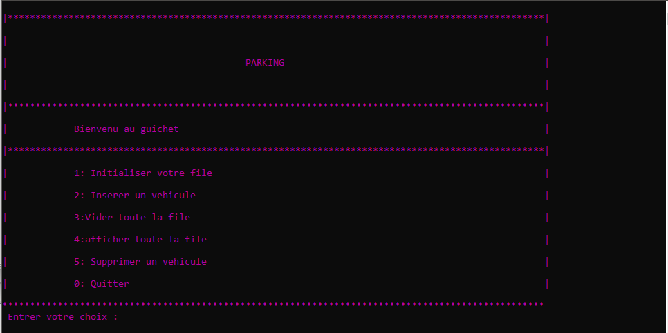

# Parking-Management
IntelliPark, a C - based console app for parking cars management

## Prequisites
- Code blocks IDE or equivalent

## Demo

## Run
- Create a project
- Include src files
- build and run your app

Here is the welcoming page:

    Any trouble or insight? feel free to open an issue.
